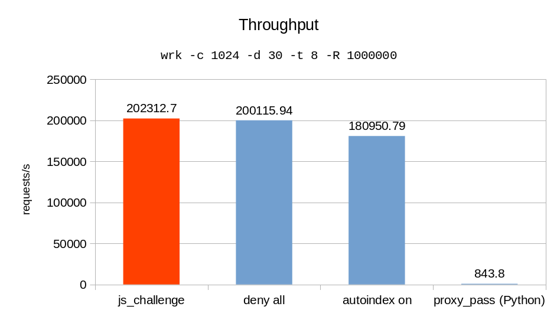

## ngx_http_js_challenge_module


[](https://www.codefactor.io/repository/github/simon987/ngx_http_js_challenge_module)

Simple javascript proof-of-work based access for Nginx with virtually no overhead.

Easy installation: just add `load_module /path/to/ngx_http_js_challenge_module.so;` to your
`nginx.conf` file and follow the [configuration instructions](#configuration).

<p align="center">
  
</p>

### Configuration

**Simple configuration**
```nginx
server {
    js_challenge on;
    js_challenge_secret "change me!";

    # ...
}
```


**Advanced configuration**
```nginx
server {
    js_challenge on;
    js_challenge_secret "change me!";
    js_challenge_html /path/to/body.html;
    js_challenge_bucket_duration 3600;
    js_challenge_title "Verifying your browser...";

    location /static {
        js_challenge off;
        alias /static_files/;
    }

    location /sensitive {
        js_challenge_bucket_duration 600;
        #...
    }

    #...
}
```

* `js_challenge on|off` Toggle javascript challenges for this config block
* `js_challenge_secret "secret"` Secret for generating the challenges. DEFAULT: "changeme"
* `js_challenge_html "/path/to/file.html"` Path to html file to be inserted in the `<body>` tag of the interstitial page
* `js_challenge_title "title"` Will be inserted in the `<title>` tag of the interstitial page. DEFAULT "Verifying your browser..."
* `js_challenge_bucket_duration time` Interval to prompt js challenge, in seconds. DEFAULT: 3600

### Installation

1. Add `load_module ngx_http_js_challenge_module.so;` to `/etc/nginx/nginx.conf`
1. Reload `nginx -s reload`

### Build from source

These steps have to be performed on machine with compatible configuration (same nginx, glibc, openssl version etc.)

1. Install dependencies
    ```bash
    apt install libperl-dev libgeoip-dev libgd-dev libxslt1-dev
    ```
2. Download nginx tarball corresponding to your current version (Check with `nginx -v`)
    ```bash
   wget https://nginx.org/download/nginx-1.16.1.tar.gz
   tar -xzf nginx-1.16.1.tar.gz
   export NGINX_PATH=$(pwd)/nginx-1.16.1/
    ```
3. Compile the module
    ```bash
    git clone https://github.com/simon987/ngx_http_js_challenge_module
    cd ngx_http_js_challenge_module
    ./build.sh
    ```
4. The dynamic module can be found at `${NGINX_PATH}/objs/ngx_http_js_challenge_module.so`
